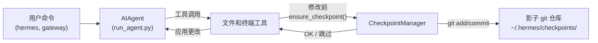

# 检查点和 `/rollback`

Hermes Agent 在**破坏性操作**之前自动为您的项目创建快照，并让您可以通过单个命令恢复它。检查点**默认启用** — 当没有文件修改工具触发时，零成本。

这个安全网由内部**检查点管理器**提供支持，它在 `~/.hermes/checkpoints/` 下维护一个单独的影子 git 仓库 — 您的真实项目 `.git` 从未被触及。

## 什么会触发检查点

在以下操作之前会自动创建检查点：

- **文件工具** — `write_file` 和 `patch`
- **破坏性终端命令** — `rm`、`mv`、`sed -i`、`truncate`、`shred`、输出重定向（`>`）和 `git reset`/`clean`/`checkout`

智能体每轮对话每个目录**最多创建一个检查点**，因此长时间运行的会话不会产生大量快照。

## 快速参考

| 命令 | 描述 |
|---------|-------------|
| `/rollback` | 列出所有检查点及其更改统计 |
| `/rollback <N>` | 恢复到检查点 N（同时撤销最后一轮对话） |
| `/rollback diff <N>` | 预览检查点 N 和当前状态之间的差异 |
| `/rollback <N> <file>` | 从检查点 N 恢复单个文件 |

## 检查点如何工作

从高层来看：

- Hermes 检测工具何时即将**修改**您的工作树中的文件。
- 每轮对话一次（每个目录），它会：
  - 为文件解析一个合理的项目根目录。
  - 初始化或重用与该目录关联的**影子 git 仓库**。
  - 使用简短、人类可读的原因暂存并提交当前状态。
- 这些提交形成一个检查点历史记录，您可以通过 `/rollback` 检查和恢复。



## 配置

检查点默认启用。在 `~/.hermes/config.yaml` 中配置：

```yaml
checkpoints:
  enabled: true          # 主开关（默认：true）
  max_snapshots: 50      # 每个目录的最大检查点数
```

要禁用：

```yaml
checkpoints:
  enabled: false
```

禁用时，检查点管理器是无操作，从不尝试 git 操作。

## 列出检查点

从 CLI 会话：

```
/rollback
```

Hermes 响应一个格式化列表，显示更改统计：

```text
📸 /path/to/project 的检查点：

  1. 4270a8c  2026-03-16 04:36  补丁前  (1 个文件, +1/-0)
  2. eaf4c1f  2026-03-16 04:35  write_file 前
  3. b3f9d2e  2026-03-16 04:34  终端前：sed -i s/old/new/ config.py  (1 个文件, +1/-1)

  /rollback <N>             恢复到检查点 N
  /rollback diff <N>        预览检查点 N 以来的更改
  /rollback <N> <file>      从检查点 N 恢复单个文件
```

每个条目显示：

- 短哈希
- 时间戳
- 原因（触发快照的内容）
- 更改摘要（文件更改、插入/删除）

## 使用 `/rollback diff` 预览更改

在提交恢复之前，预览检查点以来的更改：

```
/rollback diff 1
```

这显示 git diff 统计摘要，后跟实际差异：

```text
test.py | 2 +-
 1 个文件更改，1 次插入(+)，1 次删除(-)

diff --git a/test.py b/test.py
--- a/test.py
+++ b/test.py
@@ -1 +1 @@
-print('original content')
+print('modified content')
```

长差异限制为 80 行，以避免淹没终端。

## 使用 `/rollback` 恢复

通过编号恢复到检查点：

```
/rollback 1
```

在后台，Hermes：

1. 验证目标提交存在于影子仓库中。
2. 对当前状态进行**恢复前快照**，以便您可以稍后"撤销撤销"。
3. 恢复工作目录中的跟踪文件。
4. **撤销最后一轮对话**，以便智能体的上下文与恢复的文件系统状态匹配。

成功时：

```text
✅ 恢复到检查点 4270a8c5：补丁前
```text
✅ 恢复到检查点 4270a8c5：补丁前
已自动保存恢复前快照。
(^_^)b 撤销了 4 条消息。已删除："Now update test.py to ..."
  历史记录中剩余 4 条消息。
  对话轮次已撤销以匹配恢复的文件状态。
```

对话撤销确保智能体不会"记住"已回滚的更改，避免下一轮对话中的混淆。

## 单文件恢复

从检查点仅恢复一个文件，而不影响目录的其余部分：

```
/rollback 1 src/broken_file.py
```

当智能体更改了多个文件但只需要恢复其中一个时，这很有用。

## 安全和性能保护

为了保持检查点的安全和快速，Hermes 应用了几项保护措施：

- **Git 可用性** — 如果在 `PATH` 上找不到 `git`，检查点将被透明地禁用。
- **目录范围** — Hermes 跳过过于广泛的目录（根目录 `/`、主目录 `$HOME`）。
- **仓库大小** — 跳过超过 50,000 个文件的目录，以避免缓慢的 git 操作。
- **无更改快照** — 如果自上次快照以来没有更改，则跳过检查点。
- **非致命错误** — 检查点管理器内的所有错误都在调试级别记录；您的工具继续运行。

## 检查点的位置

所有影子仓库位于：

```text
~/.hermes/checkpoints/
  ├── <hash1>/   # 一个工作目录的影子 git 仓库
  ├── <hash2>/
  └── ...
```

每个 `<hash>` 派生自工作目录的绝对路径。在每个影子仓库中，您会发现：

- 标准 git 内部文件（`HEAD`、`refs/`、`objects/`）
- 包含精心策划的忽略列表的 `info/exclude` 文件
- 指回原始项目根目录的 `HERMES_WORKDIR` 文件

您通常永远不需要手动触摸这些。

## 最佳实践

- **保持检查点启用** — 它们默认启用，当没有文件被修改时零成本。
- **恢复前使用 `/rollback diff`** — 预览将要更改的内容以选择正确的检查点。
- **使用 `/rollback` 而不是 `git reset`** — 当您只想撤销智能体驱动的更改时。
- **与 Git 工作树结合**以获得最大安全性 — 将每个 Hermes 会话保留在自己的工作树/分支中，检查点作为额外层。

有关在同一仓库中并行运行多个智能体的信息，请参阅 [Git 工作树](./git-worktrees.md) 指南。