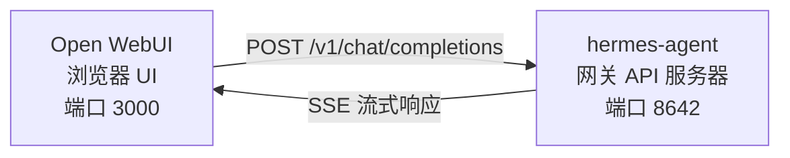

# Open WebUI

[Open WebUI](https://github.com/open-webui/open-webui) 是一个功能丰富的开源聊天前端，为 Hermes Agent 提供网页界面。它支持流式响应、多模型选择、消息格式化、文件上传和会话管理。

## 架构



## 快速设置

### 1. 启动 Hermes 网关 API 服务器

在一个终端中，启动带有 API 服务器的网关：

```bash
hermes gateway
```

### 2. 运行 Open WebUI 容器

在另一个终端中，运行 Open WebUI 容器：

```bash
docker run -d \
  --name open-webui \
  -p 3000:8080 \
  -e OLLAMA_BASE_URL=http://host.docker.internal:8642 \
  -v open-webui:/app/backend/data \
  --restart always \
  ghcr.io/open-webui/open-webui:main
```

### 3. 配置（如果需要）

默认情况下，Open WebUI 会连接到 `http://host.docker.internal:8642`。如果您的 Hermes 网关运行在不同的地址，请相应调整 `OLLAMA_BASE_URL`。

### 4. 打开 UI

前往 `http://localhost:3000`。创建您的管理员账户（第一个用户成为管理员）。您应该在模型下拉菜单中看到您的智能体（以您的配置文件命名，或默认配置文件的 **hermes-agent**）。开始聊天！

## Docker Compose 设置

对于更永久的设置，创建一个 `docker-compose.yml`：

```yaml
version: '3.8'

services:
  hermes:
    image: nousresearch/hermes-agent
    restart: always
    volumes:
      - hermes:/root/.hermes
    # 可选：暴露 API 端口
    # ports:
    #   - "8642:8642"
    command: gateway run

  open-webui:
    image: ghcr.io/open-webui/open-webui:main
    restart: always
    ports:
      - "3000:8080"
    volumes:
      - open-webui:/app/backend/data
    environment:
      - OLLAMA_BASE_URL=http://hermes:8642
    depends_on:
      - hermes

volumes:
  hermes:
  open-webui:
```

然后运行：

```bash
docker compose up -d
```

## 高级配置

### 通过 UI 配置

如果您更喜欢通过 UI 而不是环境变量配置连接：

1. 登录 Open WebUI，地址为 `http://localhost:3000`
2. 点击您的**个人资料头像** → **Admin Settings**
3. 导航到**模型**选项卡
4. 点击**添加模型**
5. 选择**从 URL 拉取模型**
6. 输入以下信息：
   - **模型名称**：`hermes-agent`（或任何您喜欢的名称）
   - **基础 URL**：`http://localhost:8642`（或您的 Hermes 网关地址）
   - **API 密钥**：留空（Hermes 网关默认不需要 API 密钥）
   - **模型**：选择 `default`
7. 点击**保存**

现在您应该在模型下拉菜单中看到 `hermes-agent`。

## 功能

Open WebUI 为 Hermes 带来了以下功能：

- 🖥️ **响应式网页界面** - 在任何设备上使用
- 📱 **移动友好** - 支持触摸和滑动
- 💬 **流式响应** - 实时查看智能体的回复
- 📁 **文件上传** - 直接上传文件进行分析
- 🎨 **消息格式化** - 支持 Markdown、代码块和表情符号
- 🔄 **会话管理** - 创建、重命名和删除会话
- 🌙 **深色模式** - 保护眼睛
- 🔧 **自定义模型设置** - 调整温度、最大令牌等

## 故障排除

| 问题 | 解决方案 |
|---------|----------|
| **无法连接到 Hermes** | 确保 `OLLAMA_BASE_URL` 指向正确的 Hermes 网关地址。对于 Docker Compose，使用服务名称（如 `http://hermes:8642`）。 |
| **模型下拉菜单为空** | 检查 Hermes 网关是否正在运行，以及 Open WebUI 是否可以访问它。尝试通过浏览器访问 `http://localhost:8642/v1/models` 查看是否返回模型列表。 |
| **文件上传失败** | 确保 Hermes 网关的 `FILE_UPLOAD_ENABLED` 环境变量设置为 `true`（默认值）。 |
| **流式响应不工作** | 检查网络连接和浏览器兼容性。Open WebUI 对 SSE（服务器发送事件）的支持需要现代浏览器。 |

## 安全注意事项

- **默认配置**：Open WebUI 允许任何人创建账户并使用智能体。对于公共服务器，考虑启用身份验证。
- **API 访问**：如果暴露 Hermes 网关的 API 端口，请确保使用防火墙限制访问。
- **文件上传**：默认情况下，文件上传是启用的。对于公共服务器，考虑禁用或限制文件大小。

Open WebUI 是使用 Hermes Agent 的绝佳方式，特别是如果您喜欢网页界面而不是命令行。它提供了丰富的功能，同时保持了与 Hermes 核心功能的完全兼容性。